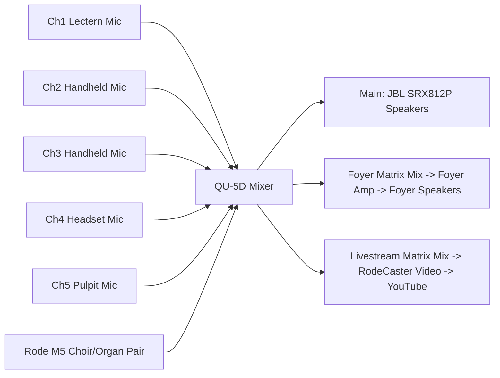

# Audio Overview

This section explains the sound system at Highfield Road Uniting Church — what
the parts are, what each microphone is for, and how sound travels from a
microphone to the people listening.

!!! tip "If you only read one thing"
    All sound passes through one device: the **Allen & Heath QU-5D mixer**.
    Microphones go **into** it; the church speakers, foyer speakers and
    livestream audio come **out** of it.

---

## The three places sound goes

The QU-5D sends sound to **three separate destinations**, each with its own
mix (its own balance of microphones):

| Destination | What it feeds | Page |
|-------------|---------------|------|
| **Main auditorium** | The JBL SRX812P speakers in the church | This page |
| **Foyer** | The foyer amplifier and foyer speakers (a dedicated matrix mix) | [Foyer Mix](foyer-mix.md) |
| **Livestream** | The RodeCaster Video, which streams to YouTube (a dedicated matrix mix) | [Livestream Mix](livestream-mix.md) |

!!! note "Why three separate mixes?"
    The people in the room, the people in the foyer, and the people watching
    online all need slightly different sound. A "matrix mix" is just a
    separate copy of the sound that we can balance on its own. For example,
    the livestream needs the microphones but **not** the room's own speakers.

---

## Signal flow (simple version)

➡️ A fuller diagram of the whole system is on the
[Signal Flow](../system-design/signal-flow.md) page.

---

## The equipment

| Item | What it is |
|------|------------|
| **Allen & Heath QU-5D** | The mixing desk. The heart of the sound system. |
| **JBL SRX812P** | The powered main speakers in the auditorium. "Powered" means each speaker has its own amplifier built in. |
| **Foyer amplifier + speakers** | Plays a dedicated foyer mix in the foyer. |
| **RodeCaster Video** | Receives the livestream audio mix and combines it with the cameras for YouTube. |

---

## The microphones (quick reference)

| Channel | Microphone | Used for |
|---------|------------|----------|
| 1 | Lectern Sennheiser condenser | Person at the lectern |
| 2 | Handheld radio mic | Roving / guest speaker |
| 3 | Handheld radio mic | Roving / guest speaker |
| 4 | Headset radio mic | Service leader (hands-free) |
| 5 | Pulpit Sennheiser condenser | Person at the pulpit |
| — | Stereo pair of Rode M5 | Choir and organ |

➡️ Full detail on each microphone: [Microphone Guide](microphone-guide.md).

---

## Common questions

**Why can't I hear a microphone?**
Its fader may be down, it may be muted, or (for radio mics) its battery may be
flat or it may be switched off. See [No Sound](../troubleshooting/no-sound.md).

**Why is there sound in the room but not on the livestream?**
The livestream uses a **separate mix**. A microphone can be turned up for the
room but not added to the livestream mix. See
[No Livestream Audio](../troubleshooting/no-livestream-audio.md).

**Why is there no sound in the foyer?**
The foyer uses its **own mix and amplifier**. Check the foyer amplifier is on.
See [Foyer Mix](foyer-mix.md).
