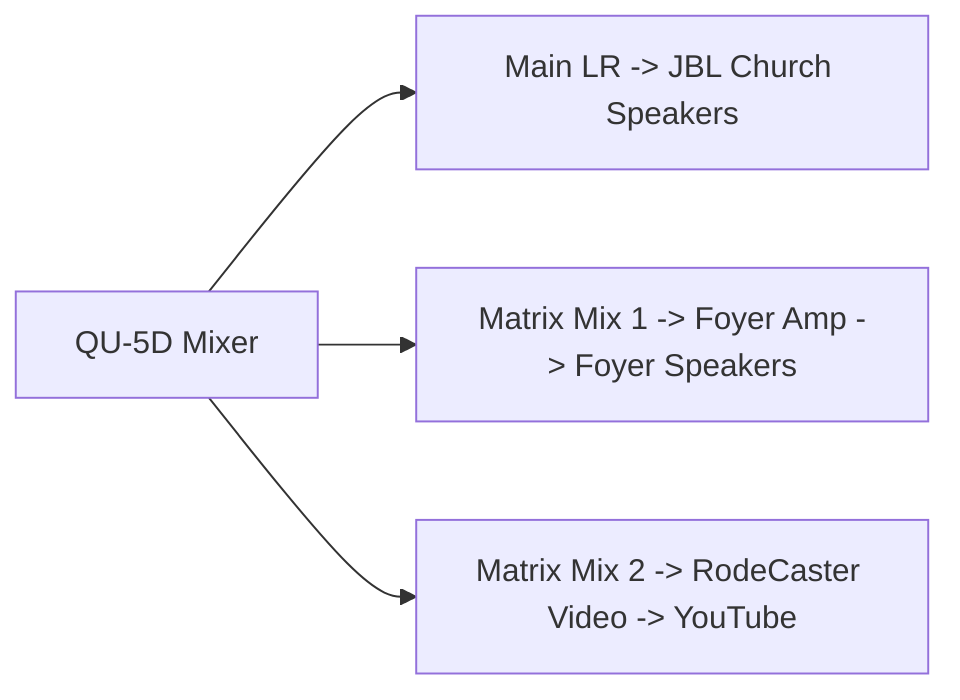

# QU-5D Mixer

The **Allen & Heath QU-5D** is the mixing desk — the large board with sliders,
knobs and a touchscreen. It is the heart of the sound system. Everything you
hear in the church, the foyer and on the livestream is balanced here.

This page explains what the main controls do, then how to use them.

📷 *Screenshot placeholder: top-down photo of the QU-5D with key areas labelled.*

---

## What the main parts do

### Faders (the sliders)

Each **fader** is a sliding control for one microphone or source.

- **Up** = louder.
- **Down** = quieter / off.

Each fader has a label strip above or below it telling you what it controls
(Lectern, Handheld 1, etc.).

### The MUTE button

Below each fader is a **MUTE** button.

- **Mute lit (red)** = that microphone is **silenced**, even if the fader is up.
- **Mute off** = the microphone can be heard (if the fader is up).

!!! tip "Mute is the fast on/off"
    To quickly silence a microphone without losing your fader position, press
    **MUTE**. Press it again to bring it back.

### The touchscreen

The **touchscreen** shows settings for whichever channel is **selected**. You
usually do **not** need to change anything here during a normal service.

### SEL (select) buttons

Pressing a channel's **SEL** button chooses that channel so the touchscreen
shows its settings. For routine operation you rarely need this.

### Master / main fader

The **main (LR) fader** controls the overall level going to the church
speakers. Leave it at its marked position unless told otherwise.

---

## How to do the everyday jobs

### Turn a microphone up or down

1. Find the fader with the matching label (e.g. **Lectern**).
2. Slide it **up** to make it louder, **down** to make it quieter.

### Silence a microphone instantly

1. Press the **MUTE** button under that fader (it lights up).
2. Press it again to un-mute.

### Set the desk to a known-good starting point (recall a scene)

The QU-5D can store a **scene** — a snapshot of all the settings for a normal
Sunday. If someone has changed things and you want to get back to normal:

1. Find the **Scenes** option on the touchscreen.
2. Select the **Sunday Service** scene.
3. Confirm **Recall**.

!!! warning "Check with Mills IT before saving scenes"
    Recalling a scene is safe. **Saving / overwriting** a scene changes the
    starting point for everyone. Only do this if Mills IT has asked you to.

📷 *Screenshot placeholder: Scenes screen on the QU-5D touchscreen.*

---

## What feeds where (important)

The QU-5D sends sound to three places, each with its own balance:

- **Main mix** → church speakers.
- **Foyer matrix mix** → [Foyer Mix](foyer-mix.md).
- **Livestream matrix mix** → [Livestream Mix](livestream-mix.md).

!!! note "Why a microphone can be on in the room but missing online"
    A fader controls the **main** mix to the room. The livestream and foyer
    are separate **matrix** mixes. If a microphone is not included in the
    livestream matrix, it will play in the room but not online.

---

## Things to avoid

!!! danger "Do not"
    - Do not turn the **main fader** far up to fix a quiet microphone — raise
      the microphone's own fader instead.
    - Do not change EQ, gain or routing on the touchscreen during a service
      unless you have been trained.
    - Do not power the mixer off while the speakers are still on (it can pop).

---

## Related pages

- [Microphone Guide](microphone-guide.md)
- [Foyer Mix](foyer-mix.md)
- [Livestream Mix](livestream-mix.md)
- [No Sound](../troubleshooting/no-sound.md)
