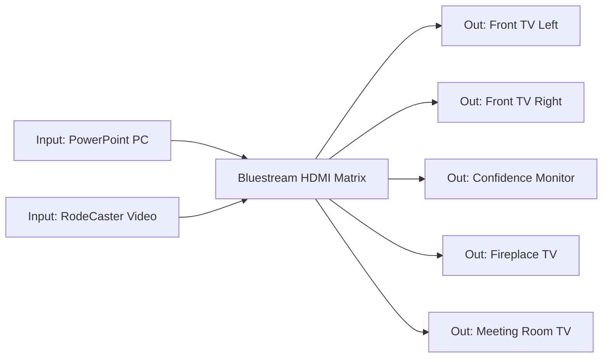

# Bluestream Matrix

The **Bluestream HDMI Matrix** is the box that decides **which picture appears
on which screen**. It takes inputs (like the PowerPoint PC) and sends them to
outputs (the TVs). This page explains what it does and how to change a route if
you ever need to.

!!! tip "Most operators never touch this"
    For a normal Sunday the matrix is already set correctly. Only read the
    "changing a route" section if a screen is showing the wrong source.

---

## What a matrix is

Think of the matrix as a **smart junction**. It has:

- Several **inputs** (sources) — e.g. the **PowerPoint PC (NUC)**, and
  possibly the **RodeCaster Video**.
- Several **outputs** (screens) — **Front TV Left**, **Front TV Right**,
  **Rear Confidence Monitor**, **Fireplace TV**, **Meeting Room TV**.

It can send **any input to any output**, independently. So the front TVs can
show the slides while the meeting room TV is off or showing something else.

---

## The normal Sunday routing

| Output (screen) | Input (source) |
|-----------------|----------------|
| Front TV Left | PowerPoint PC |
| Front TV Right | PowerPoint PC |
| Rear Confidence Monitor | PowerPoint PC |
| Fireplace TV | PowerPoint PC (if in use) |
| Meeting Room TV | PowerPoint PC (if in use) |

!!! note "Default = slides everywhere"
    By default every screen shows the **PowerPoint PC** so the slides appear
    throughout the building.

---

## How to change a route (if needed)

You can change routing either from a **web page** (the matrix's control page in
a browser on the PC) or from a small **front-panel / remote control**,
depending on how it is set up.

General idea (always read the on-screen labels):

1. Choose the **output** you want to change (e.g. *Front TV Left*).
2. Choose the **input** you want it to show (e.g. *PowerPoint PC*).
3. Confirm. The screen changes to the chosen source.

!!! warning "Change one screen at a time and check"
    Change a single output, confirm it looks right, then move on. This avoids
    accidentally blanking all the screens at once.

📷 *Screenshot placeholder: Bluestream matrix control page / remote with inputs and outputs labelled.*

---

## Getting back to normal

If the routing has been changed and you want the standard Sunday setup:

1. Set **every output** to the **PowerPoint PC** input.
2. Confirm each front TV and the confidence monitor shows the slides.

If a "preset" or "all to PC" option exists in the control page, use that.

---

## Troubleshooting

| Symptom | Likely cause | Fix |
|---------|--------------|-----|
| A TV shows the wrong source | That output routed to the wrong input | Re-route it to the **PowerPoint PC** |
| All TVs blank | Matrix off, or PC not outputting | Check matrix power and the PC; see [TV Not Working](../troubleshooting/tv-not-working.md) |
| TVs show desktop not slides | PowerPoint not full-screen | Press **F5**; see [PowerPoint Not Displaying](../troubleshooting/powerpoint-not-displaying.md) |

---

## For maintainers (Mills IT)

- Record the matrix's **IP address / control-page URL** here for future
  reference: *[add when known]*.
- Document the exact **input and output numbers** mapped to each device so
  this page can give precise instructions. *[add when known]*

---

## Related pages

- [TV Distribution](tv-distribution.md)
- [PowerPoint Operation](../presentation/powerpoint-operation.md)
- [TV Not Working](../troubleshooting/tv-not-working.md)
- [Network Overview](../system-design/network-overview.md)
