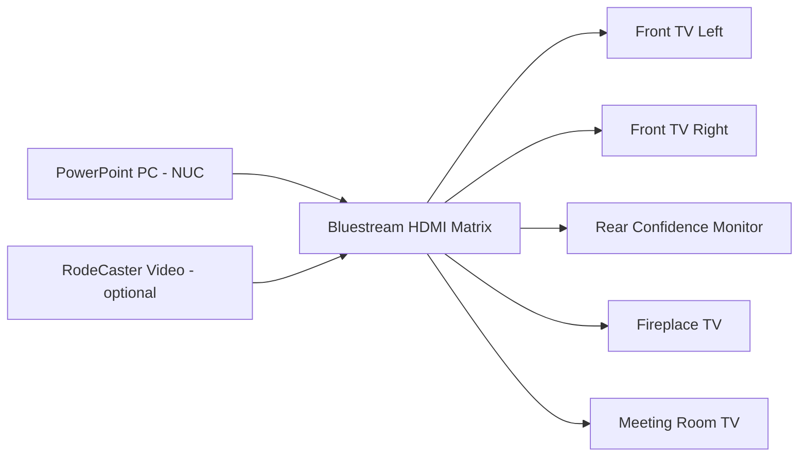

# TV Distribution

This page explains the **TVs and screens** around the church — which screen is
which, what they normally show, and how the picture gets to them.

---

## The screens

| Screen | Where it is | Normally shows |
|--------|-------------|----------------|
| **Front TV Left** | Front of auditorium, left | PowerPoint slides |
| **Front TV Right** | Front of auditorium, right | PowerPoint slides |
| **Rear Confidence Monitor** | Faces the speaker | The same slides, so the speaker can see them |
| **Fireplace TV** | Fireplace area | Optional — slides or off |
| **Meeting Room TV** | Meeting room | Optional — slides or off |

!!! note "Confidence monitor explained"
    A **confidence monitor** is a screen placed so the person speaking can see
    what the congregation sees, without turning around. Ours shows the same
    PowerPoint slides as the front TVs.

---

## Two separate things: power and picture

Two different systems control the TVs:

- **Power (on/off)** is controlled by the **RTI 7" touch screen controller**,
  located **just below the PC**. The TVs are **not** turned on by the rack
  power strip.
- **Picture (what they show)** comes from the **Bluestream HDMI Matrix**.

So to get slides on a TV, the TV must be **turned on via the RTI** *and* the
**matrix** must route the PowerPoint PC to it.

---

## How the picture reaches the TVs

All screens are fed from the **Bluestream HDMI Matrix**. A "matrix" is a smart
switch box: it can send any input (source) to any output (screen).

For a normal Sunday the matrix sends the **PowerPoint PC** to the front TVs and
confidence monitor. The detail of changing the matrix is on the
[Bluestream Matrix](bluestream-matrix.md) page.

---

## Everyday operation

For most services you do **not** need to touch the matrix at all:

1. Turn the TVs on at startup using the **RTI touch screen** (see
   [Sunday Startup — Step 5](../quick-start/sunday-startup.md#step-5-turn-on-the-tvs-rti-touch-screen)).
2. The matrix is already set to show the **PowerPoint PC** on the front TVs.
3. Start the PowerPoint slideshow (press **F5**). See
   [PowerPoint Operation](../presentation/powerpoint-operation.md).

!!! tip "If a TV shows the wrong thing"
    First check PowerPoint is in **Slide Show mode** (press **F5** on the PC).
    Only if that is correct do you need to look at the matrix routing on the
    [Bluestream Matrix](bluestream-matrix.md) page.

---

## Turning the external TVs on or off

The **Fireplace TV** and **Meeting Room TV** are only used when those areas are
in use. Turn them on from the **RTI touch screen** (the same controller used for
the other TVs), and the matrix will feed them the slides if it is routed to do
so.

---

## Why is a TV not working?

| Symptom | Likely cause | Page |
|---------|--------------|------|
| TV is black / no signal | TV off, wrong HDMI input on the TV, or matrix not routing to it | [TV Not Working](../troubleshooting/tv-not-working.md) |
| TV shows desktop, not slides | PowerPoint not in Slide Show mode | [PowerPoint Not Displaying](../troubleshooting/powerpoint-not-displaying.md) |
| Only one front TV works | That TV's power, cable or input | [TV Not Working](../troubleshooting/tv-not-working.md) |

---

## Related pages

- [Bluestream Matrix](bluestream-matrix.md)
- [PowerPoint Operation](../presentation/powerpoint-operation.md)
- [TV Not Working](../troubleshooting/tv-not-working.md)
