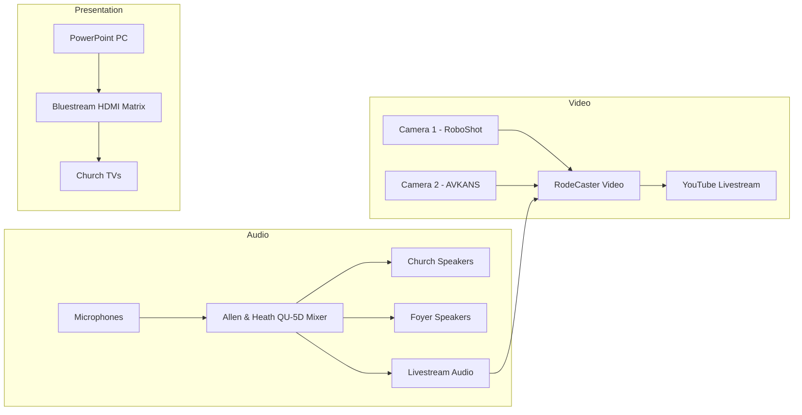

# Highfield Road Uniting Church — AV Documentation

Welcome. This website explains how to operate the audio, video, livestream
and presentation system at **Highfield Road Uniting Church**.

It is written for **volunteer operators** — you do **not** need any technical
background. Follow the steps in order and you will be able to run a Sunday
service from start to finish.

!!! tip "New here? Start with these three pages"
    1. [Sunday Startup](quick-start/sunday-startup.md) — turn everything on.
    2. [Running a Service](quick-start/service-operation.md) — what to do during the service.
    3. [Sunday Shutdown](quick-start/sunday-shutdown.md) — turn everything off safely.

---

## What this system does

Every Sunday at **9:30am** we:

- Play live sound through the church speakers so everyone can hear.
- Send a separate sound mix to the **foyer** speakers.
- **Livestream** the service to **YouTube**.
- Show **PowerPoint** slides (song words, notices) on the TVs.
- Operate **two cameras** to film the service for the livestream.

---

## The system at a glance

Don't worry if this looks complicated — you only ever press a small number of
buttons. The diagram is here so you can see how the pieces connect.

---

## How to find what you need

| I want to… | Go to |
|------------|-------|
| Turn the system on | [Sunday Startup](quick-start/sunday-startup.md) |
| Run the Sunday service | [Running a Service](quick-start/service-operation.md) |
| Turn everything off | [Sunday Shutdown](quick-start/sunday-shutdown.md) |
| Understand the microphones | [Microphone Guide](audio/microphone-guide.md) |
| Move or switch cameras | [Camera Operation](video/camera-operation.md) |
| Start or stop the livestream | [RodeCaster Video](video/rodecaster-video.md) |
| Show slides on the TVs | [PowerPoint Operation](presentation/powerpoint-operation.md) |
| Fix a problem | [Troubleshooting](troubleshooting/no-sound.md) |
| Learn the equipment names | [Glossary](training/glossary.md) |

---

## If something goes wrong

Stay calm. Most problems have a simple fix. Go to the
**[Troubleshooting](troubleshooting/no-sound.md)** section and find the page
that matches your problem.

!!! warning "When in doubt"
    If you cannot solve a problem during a service, **the service can continue
    without the livestream or slides**. The most important thing is that the
    people in the room can hear. Make a note of what happened and contact
    Mills IT afterwards.

---

## Who maintains this system

This system and documentation are maintained by **Mills IT**.

- Contact details and the support process are on the
  [Regular Checks](maintenance/regular-checks.md) page.
- Church website: <https://highfieldroadcanterburyuc.org.au/>
