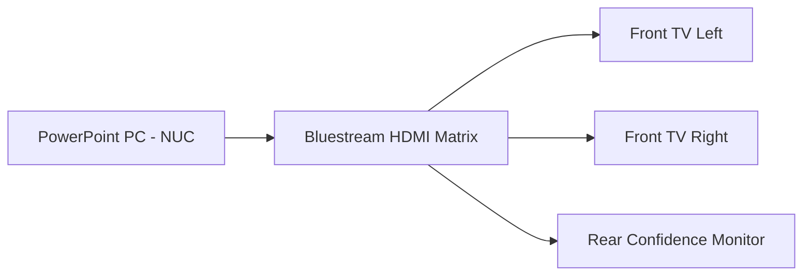

# PowerPoint Operation

The slides shown during the service — song words, readings, notices — come
from **Microsoft PowerPoint** running on the **presentation PC** (a small
Windows **NUC** computer). This page explains how to show slides and move
through them.

📷 *Screenshot placeholder: NUC, keyboard/mouse, and PowerPoint open on screen.*

---

## What you are working with

| Item | What it is |
|------|-----------|
| **Presentation PC (NUC)** | A small Windows computer that runs the slides |
| **Microsoft PowerPoint** | The program that shows the slides |
| **Bluestream HDMI Matrix** | Sends the PowerPoint picture to the TVs |
| **Front TV Left / Right** | The two screens the congregation sees |
| **Rear Confidence Monitor** | A screen facing the speaker so they can see the slides |

The PowerPoint picture travels from the PC, through the **Bluestream matrix**,
to the TVs. See [TV Distribution](../displays/tv-distribution.md).

---

## Opening the service slides

1. On the NUC, find the **Sunday service PowerPoint file** (it is usually on
   the desktop or in a clearly named folder).
2. Double-click to open it in **PowerPoint**.
3. The file for this week may be prepared by the service team — check you have
   the **correct date**.

!!! tip "Open it during startup, not at 9:29am"
    Open and check the slides during your pre-service checks so you have time
    to fix a missing or wrong file. See
    [Sunday Startup](../quick-start/sunday-startup.md).

---

## Starting the slideshow (full screen)

To show the slides full-screen on the TVs:

1. In PowerPoint, press the **F5** key to start from the beginning, **or**
   **Shift + F5** to start from the current slide.
2. The slides now fill the screen and appear on the **front TVs**.

!!! note "What 'Slide Show' mode does"
    Normal PowerPoint shows menus and thumbnails — fine for editing, but you
    do not want the congregation to see that. **Slide Show** mode shows only
    the slide, full screen. Always present in Slide Show mode.

---

## Moving through the slides

| To do this | Press |
|------------|-------|
| Next slide / next line | **Right arrow**, **Spacebar**, or **Page Down** |
| Previous slide | **Left arrow** or **Page Up** |
| Jump to a slide number | Type the **number**, then **Enter** |
| Black the screen | **B** (press again to return) |
| End the slideshow | **Esc** |

You can also use the **StreamDeck** "Next Slide" / "Previous Slide" buttons if
they are set up. See [StreamDeck Buttons](streamdeck-buttons.md).

!!! tip "Stay one step ahead"
    Listen and watch so you change the slide right as the song line or section
    changes. Being ready slightly early is better than being late.

---

## Showing PowerPoint on the TVs (the key question)

> "How do I show PowerPoint on the TVs?"

Two things must both be true:

1. **PowerPoint is in Slide Show mode** (press **F5**) on the PC, **and**
2. The **Bluestream matrix** is sending the PC's picture to the front TVs.

For a normal Sunday the matrix is already set so the **PC → Front TVs**. If
the TVs show the wrong thing (or a desktop), see
[TV Distribution](../displays/tv-distribution.md) and
[PowerPoint Not Displaying](../troubleshooting/powerpoint-not-displaying.md).

---

## The confidence monitor

The **Rear Confidence Monitor** faces the speaker so they can see the current
slide without turning around. It normally shows the **same slides** as the
front TVs.

---

## Common problems

| Problem | Likely cause | Fix |
|---------|--------------|-----|
| TVs show the desktop, not slides | PowerPoint not in Slide Show mode | Press **F5** |
| Slides on PC but not on TVs | Matrix not routing PC to TVs, or HDMI issue | [PowerPoint Not Displaying](../troubleshooting/powerpoint-not-displaying.md) |
| Wrong slides | Wrong file open | Open the correct dated file |
| Slides frozen | PC or PowerPoint stuck | Press **Esc**, restart the slideshow |

---

## Related pages

- [StreamDeck Buttons](streamdeck-buttons.md)
- [TV Distribution](../displays/tv-distribution.md)
- [Bluestream Matrix](../displays/bluestream-matrix.md)
- [PowerPoint Not Displaying](../troubleshooting/powerpoint-not-displaying.md)
