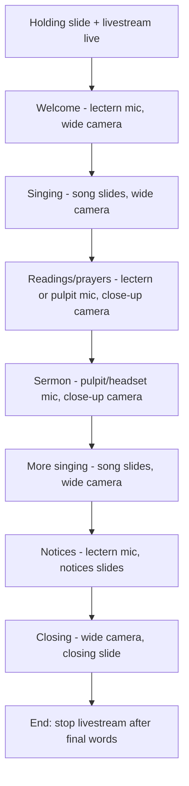

# Running a Service

This page explains what you do **during** the 9:30am Sunday service. By now
the system should already be on — if not, go to
[Sunday Startup](sunday-startup.md) first.

Your job during the service is to:

- Open and close the right **microphones** at the right time.
- Switch the **cameras** to follow what is happening.
- Advance the **PowerPoint slides**.
- Keep an eye on the **livestream**.

!!! tip "Golden rule"
    The most important job is **sound in the room**. If you have to choose
    where to focus, always keep the in-room sound working first. Cameras and
    livestream are second.

---

## Before the service starts

- Confirm the livestream is **live** (you started it in
  [Step 11 of startup](sunday-startup.md#step-11-start-the-livestream-at-925am)).
- Have a **holding slide** showing (church name / welcome).
- Make sure the lectern microphone is **on** and ready for the first speaker.

---

## Microphones — who uses what

| When | Microphone | Channel |
|------|------------|---------|
| Speaking from the lectern | Lectern Sennheiser condenser | Channel 1 |
| Speaking from the pulpit | Pulpit Sennheiser condenser | Channel 5 |
| Roving speaker / guest | Handheld radio mic | Channel 2 or 3 |
| Service leader moving around | Headset radio mic | Channel 4 |
| Choir or organ | Stereo pair of Rode M5 | Choir/Organ channels |

**Open a microphone** = raise its fader (slider) so sound comes through.
**Close a microphone** = lower its fader when not in use.

!!! tip "Only open the microphones being used"
    Open microphones pick up background noise and can cause feedback (a loud
    squeal). Lower the fader for any microphone nobody is speaking into.

➡️ Full detail: [Microphone Guide](../audio/microphone-guide.md)

---

## Cameras — following the service

You have two cameras:

- **Camera 1 — RoboShot HDMI 12** — usually a **wide** shot of the front.
- **Camera 2 — AVKANS 20X PTZ Camera Pro** — usually for **close-ups**
  (the speaker, the lectern).

To change which camera the livestream shows, press the matching **camera
button on the StreamDeck**. The picture changes smoothly.

!!! note "Simple camera plan for a normal service"
    - **Singing / whole congregation** → wide shot (Camera 1).
    - **Someone speaking** → close-up of that person (Camera 2).
    - When unsure, stay on the **wide shot**. A steady wide shot always looks
      fine.

➡️ Full detail: [Camera Operation](../video/camera-operation.md)

---

## PowerPoint — advancing the slides

The slides (song words, notices, readings) are run from **PowerPoint** on the
presentation PC.

- Press the **right arrow** (or the StreamDeck "Next Slide" button) to move
  **forward**.
- Press the **left arrow** to go **back**.

!!! tip "Stay one step ahead"
    Watch and listen so you can change the slide just as the song or section
    changes. It is better to be ready slightly early than late.

➡️ Full detail: [PowerPoint Operation](../presentation/powerpoint-operation.md)

---

## A typical Sunday service flow

This is a guide, not a strict rule. Every service is a little different —
follow what is actually happening in the room.

---

## Keep an eye on the livestream

Every few minutes, glance at:

- The **RodeCaster Video** screen — is it still streaming?
- A phone or the PC showing the **YouTube** stream — does it look and sound
  right?

If the livestream drops out, see
[No Livestream Audio](../troubleshooting/no-livestream-audio.md) or
[No Camera Video](../troubleshooting/no-camera-video.md).

!!! warning "A livestream problem is not an emergency"
    If the livestream has trouble, the in-room service continues normally.
    Fix it calmly if you can; if not, note it for Mills IT and carry on.

---

## At the end of the service

1. Switch to a **closing / holding slide**.
2. Keep the livestream running for a minute or two after the final words.
3. **Stop the livestream** (StreamDeck "Stop Stream" button).
4. Lower all microphone faders.

Then move on to **[Sunday Shutdown](sunday-shutdown.md)** to turn everything
off safely.
