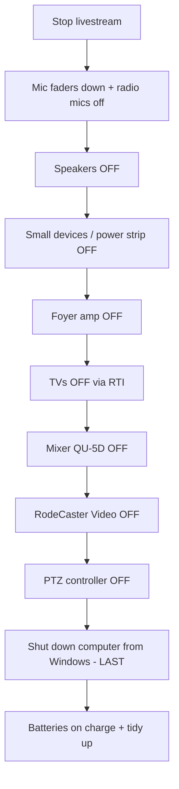

# Sunday Shutdown

This page tells you how to turn the system off **safely** after the service.
The shutdown is the **startup in reverse order** — with one exception: the
**computer is shut down last**, from the computer itself.

!!! tip "The short version (reverse of startup)"
    1. **Stop the livestream** (StreamDeck **Stop Stream**).
    2. Turn down all **microphone faders**; turn off the **radio mics**.
    3. Turn off **both speakers** (light switches, back of rack near floor).
    4. Turn off the **small devices** (top power strip, back of rack).
    5. Turn off the **foyer amp** (switch on front of amp, front of rack).
    6. Turn off **all TVs** using the **RTI 7" touch screen** (below the PC).
    7. Turn off the **QU-5D mixer** (push button, back right).
    8. Turn off the **RodeCaster Video** (red push button, back right).
    9. Turn off the **PTZ controller** (rocker switch, back right near top).
    10. **Shut down the computer from the computer** (Windows → Shut down) — **last**.
    11. Put microphone batteries on charge and tidy up.

!!! warning "Order matters"
    Turn the **speakers off before the mixer** (Steps 3 and 7). This avoids a
    loud "pop" through the speakers. And always **stop the livestream first**.

---

## Step 1 — Stop the livestream

If you have not already done so at the end of the service:

1. On the **StreamDeck**, press the **Stop Stream** button.
2. Confirm on the **RodeCaster Video** screen that streaming has stopped.

➡️ Detail: [RodeCaster Video](../video/rodecaster-video.md)

!!! warning "Always stop the stream before powering down"
    If you switch things off while still streaming, viewers see the stream cut
    out abruptly and YouTube may flag it. Stop the stream first.

!!! note "Leave the computer on until the very end"
    The StreamDeck only works while the **computer** is on, so the computer is
    shut down **last** (Step 10). Don't turn it off early.

---

## Step 2 — Turn down the microphones

1. On the **QU-5D mixer**, lower **every microphone fader** to the bottom.
2. Switch **off** the **handheld** and **headset** radio microphones.

This makes sure nothing is "live" while you power things off.

---

## Step 3 — Turn off both speakers

Switch off the **two light switches** on the **back of the rack, near the
floor** (the **JBL SRX812P** speakers).

📷 *Screenshot placeholder: speaker light switches (back of rack, near floor).*

---

## Step 4 — Turn off the small devices

At the **back of the rack**, switch **off** the **power switch on the top
power strip** (the **three radio microphone receivers**, the **Apple TV** and
the **Blu-ray player**).

📷 *Screenshot placeholder: top power strip switch (back of rack).*

---

## Step 5 — Turn off the foyer amplifier

Switch off the **foyer amplifier** using the **switch on the front of the
amp**, at the **front of the rack**.

📷 *Screenshot placeholder: foyer amplifier power switch (front of rack).*

---

## Step 6 — Turn off the TVs (RTI touch screen)

On the **RTI 7" touch screen controller** (just below the PC), choose the
option to **turn off all TVs**. This includes the **Front TV Left**, **Front
TV Right**, **Rear Confidence Monitor**, and the **Fireplace TV** and **Meeting
Room TV** if they were used.

📷 *Screenshot placeholder: RTI touch screen "all off".*

---

## Step 7 — Turn off the mixer (QU-5D)

Now that the speakers are off, switch off the **Allen & Heath QU-5D** using the
**push button at the back right, near the bottom power cable**.

➡️ Detail: [QU-5D Mixer](../audio/qu5d-overview.md)

---

## Step 8 — Turn off the RodeCaster Video

Switch off the **RodeCaster Video** using the **red push button at the back
right**.

➡️ Detail: [RodeCaster Video](../video/rodecaster-video.md)

---

## Step 9 — Turn off the PTZ controller

Switch off the **AVKANS Joy Pro Controller** using the **rocker switch at the
back right, near the top**.

➡️ Detail: [PTZ Controller](../video/ptz-controller.md)

---

## Step 10 — Shut down the computer (last)

The computer is turned off **last**, and **from the computer itself** — not by
pulling the power.

1. On the **mini PC (NUC)**, open the Windows **Start** menu.
2. Choose **Power → Shut down**.
3. Wait for Windows to fully shut down.

!!! note "Why shut down from Windows"
    Using Windows **Shut down** (rather than holding the power button) keeps
    **PowerPoint** and **Bitfocus Companion** healthy for next week. Because
    the StreamDeck runs on this computer, leaving it until last means the
    **Stop Stream** button still worked back in Step 1.

---

## Housekeeping — microphones and batteries

1. Place rechargeable batteries on charge, **or** remove batteries if the
   policy is to store them out of the microphones.
2. Coil cables loosely and return handheld mics to their stands or case.

➡️ Detail: [Battery Replacement](../maintenance/battery-replacement.md)

!!! tip "Leave it tidy"
    Make sure the area is ready for the next operator. A tidy desk is a fast
    startup next Sunday.

---

## Shutdown order at a glance

That's it — the system is safely shut down until next Sunday.
