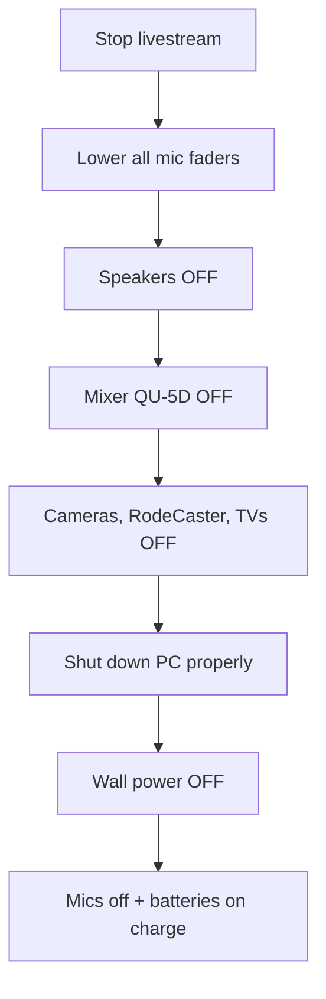

# Sunday Shutdown

This page tells you how to turn the system off **safely** after the service.
Doing it in the right order protects the equipment and means it will start up
cleanly next week.

!!! tip "The short version"
    1. **Stop the livestream**.
    2. Turn down all **microphones**.
    3. Turn off the **speakers** first.
    4. Turn off the **mixer (QU-5D)**.
    5. Turn off **cameras, RodeCaster, TVs, PC**.
    6. Turn off the **wall power**.
    7. Put microphones on charge / store batteries.

!!! warning "Order matters"
    Always turn the **speakers off before the mixer**. This is the opposite of
    startup. It stops a loud "pop" coming through the speakers.

---

## Step 1 — Stop the livestream

If you have not already done so at the end of the service:

1. On the **StreamDeck**, press the **Stop Stream** button.
2. Confirm on the **RodeCaster Video** screen that streaming has stopped.

➡️ Detail: [RodeCaster Video](../video/rodecaster-video.md)

!!! warning "Always stop the stream before powering down"
    If you switch things off while still streaming, viewers see the stream cut
    out abruptly and YouTube may flag it. Stop the stream first.

---

## Step 2 — Turn down all microphones

On the **QU-5D mixer**, lower every microphone fader to the bottom. This
makes sure nothing is "live" while you power things off.

---

## Step 3 — Turn off the speakers

1. Switch off each **JBL SRX812P** main speaker.
2. Switch off the **foyer amplifier**.

📷 *Screenshot placeholder: JBL speaker power switch, foyer amplifier switch.*

---

## Step 4 — Turn off the mixer (QU-5D)

Now that the speakers are off, switch off the **Allen & Heath QU-5D** using
its rear power switch.

➡️ Detail: [QU-5D Mixer](../audio/qu5d-overview.md)

---

## Step 5 — Turn off cameras, RodeCaster, TVs and PC

In any order, turn off:

- **Camera 1** (RoboShot HDMI 12) and **Camera 2** (AVKANS 20X PTZ).
- The **RodeCaster Video**.
- The **Front TV Left**, **Front TV Right** and **Rear Confidence Monitor**.
- The external TVs if they were used (**Fireplace TV**, **Meeting Room TV**).
- The **presentation PC (NUC)** — shut down Windows properly (Start →
  Power → Shut down), do not just pull the power.

!!! note "Shut the PC down properly"
    Use Windows **Shut down** rather than holding the power button. This keeps
    PowerPoint and Companion healthy for next week.

---

## Step 6 — Turn off the wall power

Once everything has powered down, switch off the main wall power points for
the AV rack and speakers.

---

## Step 7 — Microphones and batteries

1. Turn off the **handheld** and **headset** radio microphones.
2. Place rechargeable batteries on charge, **or** remove batteries if the
   policy is to store them out of the microphones.

➡️ Detail: [Battery Replacement](../maintenance/battery-replacement.md)

!!! tip "Leave it tidy"
    Coil cables loosely, return handheld mics to their stands or case, and
    make sure the area is ready for the next operator. A tidy desk is a fast
    startup next Sunday.

---

## Shutdown order at a glance

That's it — the system is safely shut down until next Sunday.
