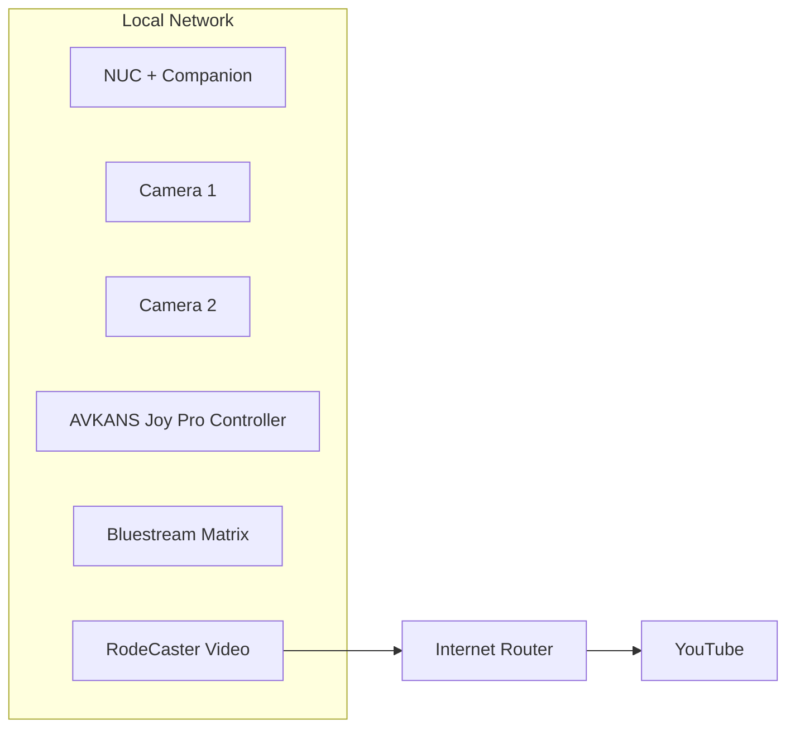

# Network Overview

The livestream and some of the control systems rely on the church **network
and internet**. This page explains, in simple terms, what uses the network and
what to check if the livestream keeps dropping. It is mainly for maintainers
(Mills IT), with a short operator section.

---

## What uses the network

| Device | Uses the network for |
|--------|----------------------|
| **RodeCaster Video** | Sending the livestream to **YouTube** (needs internet) |
| **PTZ cameras** (RoboShot, AVKANS) | Control commands (pan/tilt/zoom, presets) over the local network |
| **AVKANS Joy Pro Controller** | Sending control commands to the cameras |
| **Bitfocus Companion / NUC** | Talking to the RodeCaster, cameras and other gear |
| **Bluestream HDMI Matrix** | Its control page (if controlled over the network) |

!!! note "Two different jobs"
    The network does **two** things here:
    1. **Local control** — devices talking to each other inside the building
       (cameras, Companion, matrix). This does **not** need the internet.
    2. **Internet** — only the **livestream to YouTube** needs a working
       internet connection.

---

## For operators: what you need to know

You normally don't touch the network. The two things worth knowing:

1. If the **livestream keeps dropping or won't start**, the **internet** may
   be the problem — not the AV gear.
2. If **camera control or StreamDeck presets** stop working but everything is
   powered on, the **local network** may need a restart (a maintainer task).

!!! tip "Operator first aid for a dropping stream"
    - Confirm other internet works (e.g. YouTube loads on a phone on the
      church Wi-Fi).
    - If the internet is down, the **in-room service continues normally** —
      the livestream simply can't go out until the internet returns.
    - Note the time it happened and tell Mills IT.

---

## Simple network picture

---

## For maintainers (Mills IT)

Record the specifics here so the system can be supported long-term:

- **Router / modem** make, model and location: *[add]*
- **Network switch(es)** location and ports: *[add]*
- **Static IP addresses** (record each so devices can be found again):
    - RodeCaster Video: *[add]*
    - Camera 1 (RoboShot HDMI 12): *[add]*
    - Camera 2 (AVKANS 20X PTZ): *[add]*
    - AVKANS Joy Pro Controller: *[add]*
    - Bluestream HDMI Matrix: *[add]*
    - NUC (presentation PC): *[add]*
- **Wi-Fi vs wired:** which devices are wired (recommended for cameras,
  RodeCaster and NUC) vs wireless: *[add]*
- **Upload speed** required/available for the YouTube livestream: *[add]*
- **YouTube** channel and stream configuration location: *[add]*

!!! warning "Keep streaming on a wired connection"
    The RodeCaster Video should use a **wired** internet connection wherever
    possible. Wi-Fi can cause the livestream to stutter or drop.

---

## Troubleshooting the stream/network

| Symptom | Likely cause | Action |
|---------|--------------|--------|
| Stream won't start | No internet, or YouTube not ready | Check internet on a phone; confirm stream is started |
| Stream keeps dropping | Weak/wired connection, low upload speed | Use wired connection; contact Mills IT |
| Cameras won't respond to control | Local network/switch issue | Check power and cabling; restart network gear (maintainer) |
| Presets/StreamDeck offline | Companion can't reach devices | Restart NUC/Companion; check network |

➡️ Related: [RodeCaster Video](../video/rodecaster-video.md) ·
[Camera Not Moving](../troubleshooting/camera-not-moving.md) ·
[No Camera Video](../troubleshooting/no-camera-video.md)
