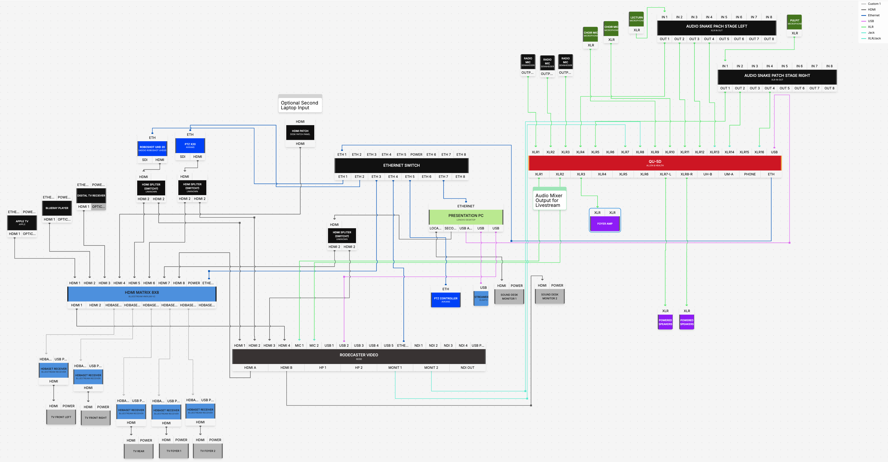
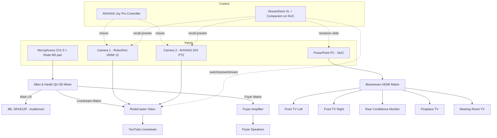
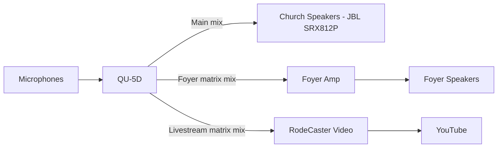
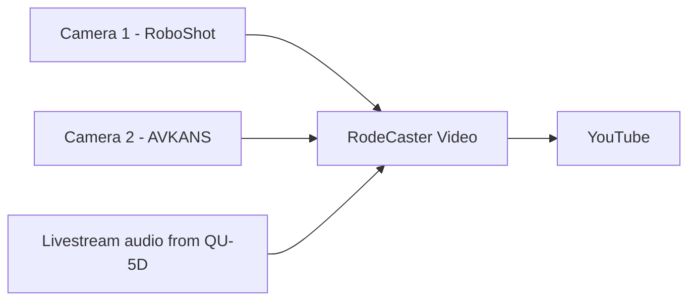
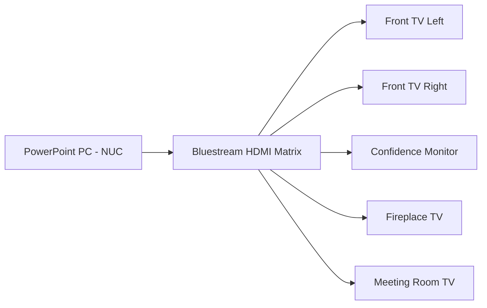

# Signal Flow

This page shows how **sound** and **video** travel through the system, from
microphones and cameras all the way to the speakers, screens and YouTube. It is
mainly for maintainers and for AI assistants answering "what connects to what"
questions, but the diagrams are simple enough for anyone.

---

## Physical wiring diagram

The diagram below shows the actual physical connections (cabling) between the
equipment.

!!! warning "Draft diagram — work in progress"
    This is an early rough draft (**v3**). It will be replaced once Mills IT
    has confirmed every connection and channel on site. Treat the **logical
    diagrams below** and the [Equipment List](equipment-list.md) as the more
    reliable reference until this wiring diagram is finalised.

---

## The whole system

---

## Audio signal flow

Key points:

- **One mixer, three outputs.** The QU-5D builds the main, foyer and
  livestream mixes independently.
- The **livestream** and **foyer** are **matrix mixes** — separate balances,
  not just copies of the room sound. This is why a microphone can be present in
  one mix but not another.

➡️ [Audio Overview](../audio/overview.md) · [Livestream Mix](../audio/livestream-mix.md) · [Foyer Mix](../audio/foyer-mix.md)

---

## Video signal flow

Key points:

- Both cameras feed the **RodeCaster Video**.
- The RodeCaster combines the chosen camera with the **livestream audio mix**
  and streams to **YouTube**.

➡️ [Video Overview](../video/overview.md) · [RodeCaster Video](../video/rodecaster-video.md)

---

## Presentation / display signal flow

Key points:

- The **PowerPoint PC** is the source.
- The **Bluestream matrix** routes that picture to any of the screens.

➡️ [TV Distribution](../displays/tv-distribution.md) · [Bluestream Matrix](../displays/bluestream-matrix.md)

---

## How control flows (who tells what to do)

| Control | Talks to | To do what |
|---------|----------|-----------|
| **StreamDeck XL** (via Companion on the NUC) | RodeCaster, cameras, PowerPoint | Switch cameras, recall presets, start/stop stream, change slides |
| **AVKANS Joy Pro Controller** | Camera 1 and Camera 2 | Pan, tilt, zoom by hand |
| **QU-5D faders/mutes** | The three audio mixes | Balance sound for room, foyer, livestream |

---

## Where signals are most likely to break (for troubleshooting)

| Link | If it fails | Page |
|------|-------------|------|
| Mic → QU-5D | No / one mic missing | [No Sound](../troubleshooting/no-sound.md) |
| QU-5D livestream matrix → RodeCaster | No audio online | [No Livestream Audio](../troubleshooting/no-livestream-audio.md) |
| Camera → RodeCaster | Black/frozen camera | [No Camera Video](../troubleshooting/no-camera-video.md) |
| Controller → Camera | Camera won't move | [Camera Not Moving](../troubleshooting/camera-not-moving.md) |
| PC → Matrix → TV | Blank / wrong screen | [TV Not Working](../troubleshooting/tv-not-working.md) |
| RodeCaster → YouTube | Stream drops | [Network Overview](network-overview.md) |
