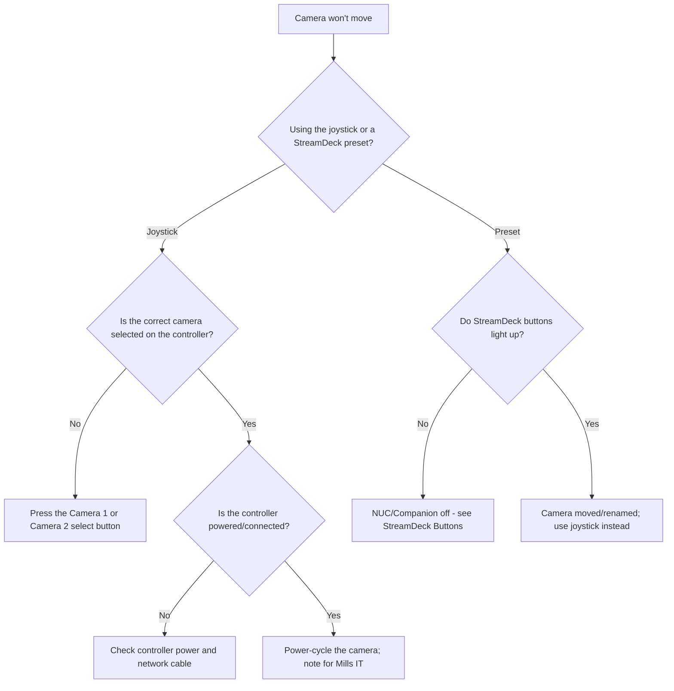

# Troubleshooting: Camera Not Moving

Use this page when a camera **won't pan, tilt or zoom** — the joystick or a
StreamDeck preset button does nothing, or the camera won't go to a saved
position.

!!! tip "Most common cause"
    The **wrong camera is selected** on the controller, so the joystick is
    moving a camera you're not watching.

---

## Step-by-step checks

---

## A. The joystick won't move the camera

1. **Right camera selected?** On the **AVKANS Joy Pro Controller**, press the
   **Camera 1** or **Camera 2** select button for the camera you want to move.
   The joystick only moves the selected camera.
2. **Are you watching the camera you're moving?** You may be moving the
   off-air camera correctly — switch the livestream/preview to it to confirm.
3. **Controller powered and connected?** Check the controller has power and
   its network/control cable is connected.
4. **Camera responsive at all?** If still nothing, power-cycle the camera
   (off, wait ~20 seconds, on) and try again.

➡️ Controller detail: [PTZ Controller](../video/ptz-controller.md).

---

## B. A StreamDeck preset button won't move the camera

1. **Do the StreamDeck buttons light up at all?** If **no**, the **NUC or
   Companion** is off — the buttons can't work. See
   [StreamDeck Buttons](../presentation/streamdeck-buttons.md).
2. **Buttons light up but the preset does nothing?** The camera may have been
   moved or its preset changed. Use the **joystick** to aim it for now and note
   it for Mills IT.

---

## C. The camera moves but the wrong way / too fast

This is normal joystick behaviour, not a fault:

- Push the joystick **gently** for slow movement, **further** for faster.
- If it moves the opposite way to what you expect, simply move it the other
  direction. Make small movements.

---

## Keep the service going

!!! note "A still camera is fine"
    If a camera won't move, just leave it on a sensible **wide shot** and run
    the service from there. You do not need camera movement to livestream
    successfully.

---

## Quick reference

| Symptom | Likely cause | Fix |
|---------|--------------|-----|
| Joystick does nothing | Wrong camera selected | Press the correct camera-select button |
| Joystick still does nothing | Controller not connected | Check controller power/cable |
| Preset button does nothing, buttons unlit | NUC/Companion off | Turn on NUC; restart Companion |
| Preset wrong position | Preset changed/camera moved | Use joystick; note for Mills IT |

---

## Related pages

- [PTZ Controller](../video/ptz-controller.md)
- [Camera Operation](../video/camera-operation.md)
- [StreamDeck Buttons](../presentation/streamdeck-buttons.md)
- [No Camera Video](no-camera-video.md)
