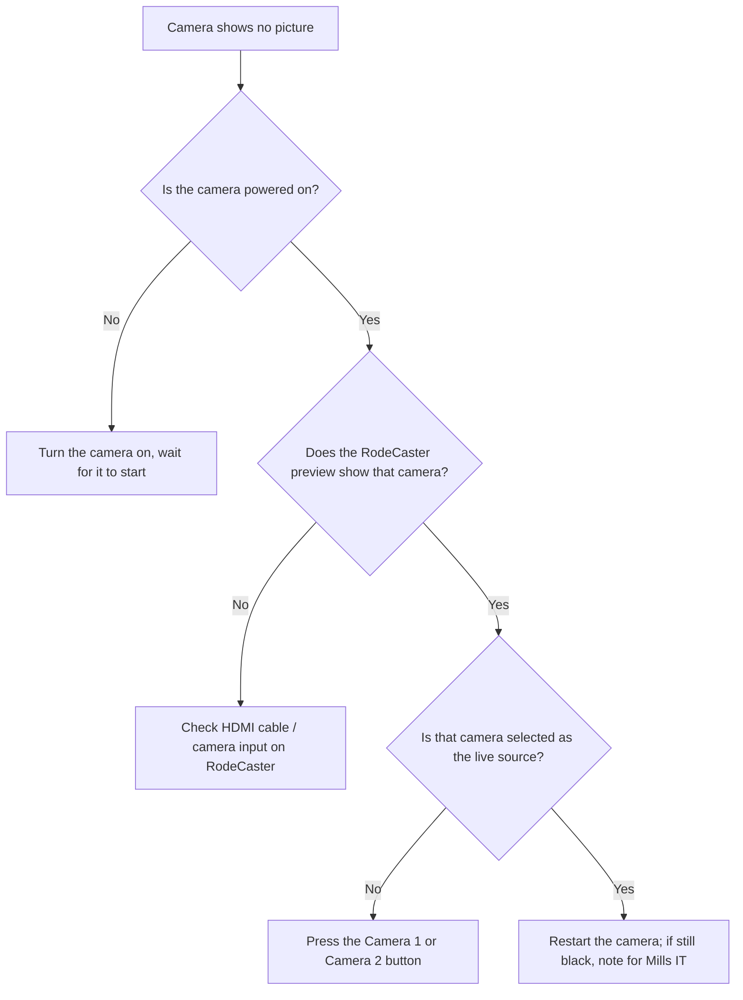

# Troubleshooting: No Camera Video

Use this page when a **camera shows no picture** — for example the RodeCaster
shows black where a camera should be, or the livestream picture is black or
frozen.

!!! tip "Most common cause"
    A camera is **switched off / not finished starting up**, or the
    **wrong source** is selected on the RodeCaster.

---

## Which camera?

| Camera | Model | Usual shot |
|--------|-------|-----------|
| **Camera 1** | RoboShot HDMI 12 | Wide |
| **Camera 2** | AVKANS 20X PTZ Camera Pro | Close-up |

---

## Step-by-step checks

1. **Is the camera on?** Check the camera has power and its indicator is lit.
   Cameras take a little time to start — wait ~30 seconds after power on.
2. **Does the RodeCaster preview show it?** Look at the **RodeCaster Video**
   screen. If that camera's preview is **black**:
    - The **HDMI cable** from the camera may be loose — check both ends if
      safe to do so.
    - The camera may still be starting up — wait, then try again.
3. **Is it selected as the live source?** If the preview is fine but the
   livestream is black, you may simply be showing a different/blank source.
   Press the **Camera 1** or **Camera 2** button to select it. See
   [Camera Operation](../video/camera-operation.md).
4. **Still black?** Restart that camera (power off, wait, power on). If it
   still has no picture, switch the livestream to the **other camera** and note
   the fault for Mills IT.

---

## Picture is frozen (not black)

- The camera or its connection may have glitched. Switch to the **other
  camera**, then power-cycle the frozen one (off, wait, on).
- If the whole livestream picture froze, the issue may be the **internet** —
  see [Network Overview](../system-design/network-overview.md).

---

## Keep the service going

!!! note "One camera is enough"
    If one camera fails, run the whole livestream on the **other camera** —
    usually **Camera 1 (wide)**. A single steady wide shot is perfectly
    acceptable. Do not let a camera fault stop the stream.

---

## Quick reference

| Symptom | Likely cause | Fix |
|---------|--------------|-----|
| Black where a camera should be | Camera off / starting / HDMI loose | Power on, wait, check cable |
| Livestream black but preview fine | No live source selected | Press Camera 1 / Camera 2 |
| Picture frozen | Camera glitch or internet | Switch cameras; power-cycle; check network |
| Both cameras black | Power or RodeCaster issue | Check power; restart RodeCaster |

---

## Related pages

- [Camera Operation](../video/camera-operation.md)
- [RodeCaster Video](../video/rodecaster-video.md)
- [Camera Not Moving](camera-not-moving.md)
- [Network Overview](../system-design/network-overview.md)
