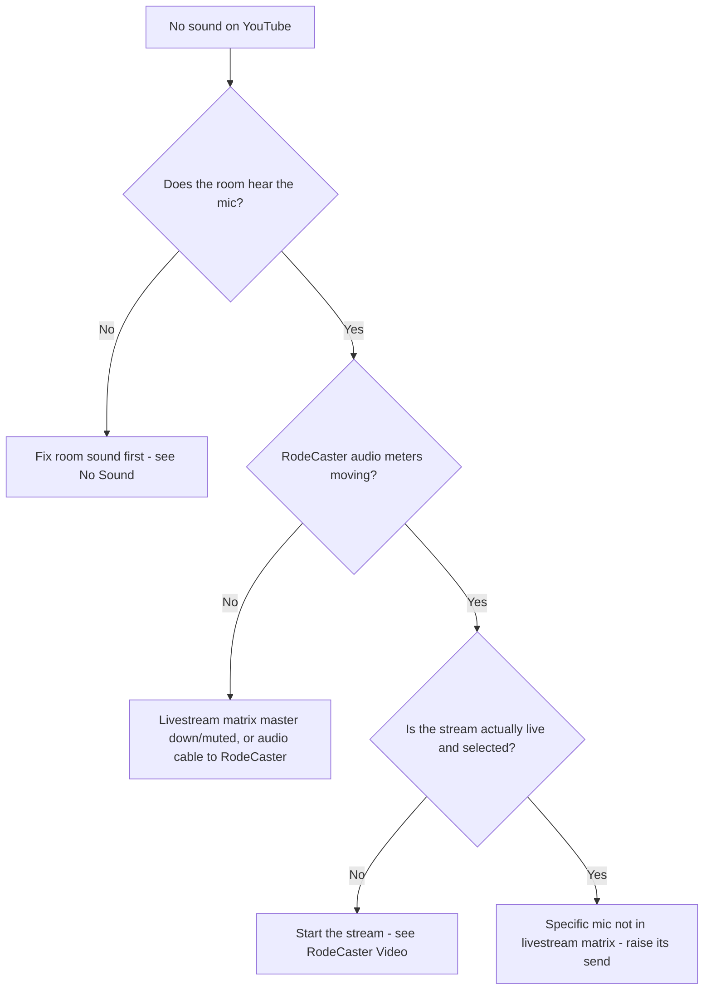

# Troubleshooting: No Livestream Audio

Use this page when the **picture is fine on YouTube but online viewers can't
hear** (or the sound is too quiet online). The room may sound perfectly fine —
that is expected, because the livestream uses a **separate audio mix**.

!!! tip "Most common cause"
    A microphone is up for the **room** but is **not in the livestream matrix
    mix**, or the **livestream matrix master** is down/muted on the QU-5D.

---

## First, confirm the problem

1. On a phone, open the **YouTube** stream (use headphones to avoid feedback).
2. Have someone speak into the microphone in question.
3. If the room hears them but the stream does not → it's a **livestream mix**
   problem (this page). If the **room** can't hear them either → go to
   [No Sound](no-sound.md) first.

---

## Step-by-step checks

1. **Room hears it?** If not, fix the room first → [No Sound](no-sound.md).
2. **RodeCaster audio meters moving?** Look at the **RodeCaster Video**
   audio meters. If they are **not moving** when someone speaks:
    - The **livestream matrix master** on the QU-5D may be **down or muted** —
      raise / un-mute it.
    - Or the audio cable from the QU-5D to the RodeCaster has a problem — note
      for Mills IT.
3. **Meters moving but still nothing on YouTube?** Confirm the stream is
   actually **live** → [RodeCaster Video](../video/rodecaster-video.md).
4. **One specific mic missing online only?** That microphone is not in the
   **livestream matrix**. Raise its **send** to the livestream matrix on the
   QU-5D → [Livestream Mix](../audio/livestream-mix.md).

---

## How the livestream audio is meant to flow

If any link in this chain is missing, online viewers lose sound while the room
may be unaffected.

---

## Quick reference

| What you see | Likely cause | Fix |
|--------------|--------------|-----|
| No sound online, room fine, meters still | Livestream matrix master down/muted | Raise / un-mute it on QU-5D |
| No sound online, meters moving | Stream not live, or YouTube delay | Confirm stream is live; wait a few seconds |
| One mic missing online only | Mic not in livestream matrix | Raise that mic's livestream send |
| Audio crackly / cutting out | Cable or connection | Note for Mills IT |

---

## If you can't fix it during the service

The in-room service is unaffected — **carry on**. Note the time and symptom
and contact **Mills IT** afterwards. Online viewers can be told (via a slide or
the YouTube description) if audio was affected.

---

## Related pages

- [Livestream Mix](../audio/livestream-mix.md)
- [RodeCaster Video](../video/rodecaster-video.md)
- [No Sound](no-sound.md)
- [QU-5D Mixer](../audio/qu5d-overview.md)
