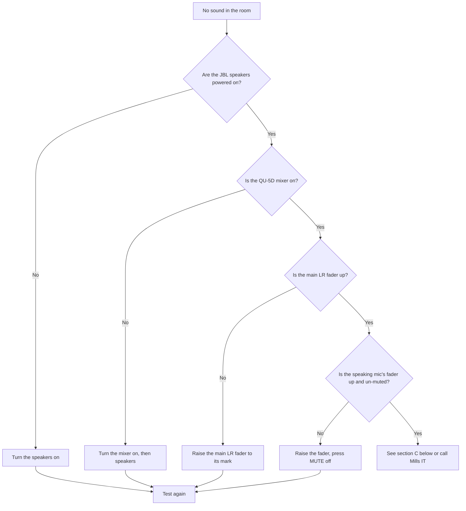

# Troubleshooting: No Sound

Use this page when there is **no sound in the church** (the main auditorium),
or when **one microphone** can't be heard. Work through the checks **in order**
and stop as soon as the sound comes back.

!!! tip "Stay calm — it's usually simple"
    The most common causes are a **fader down**, a **mute button on**, or a
    **radio mic switched off / flat battery**. Check those first.

---

## A. No sound at all in the room

Step by step:

1. **Speakers on?** Check the **JBL SRX812P** speakers are powered. If off,
   turn them on.
2. **Mixer on?** Check the **QU-5D** is on and the screen is lit. If off, turn
   the mixer on first, then the speakers.
3. **Main fader up?** The **main (LR) fader** controls overall room volume.
   Raise it to its normal mark.
4. **The mic in use — fader up and un-muted?** Raise that channel's fader and
   make sure its **MUTE** light is **off**.

➡️ Mixer controls: [QU-5D Mixer](../audio/qu5d-overview.md).

---

## B. One particular microphone can't be heard

| Microphone | Channel | Check these |
|------------|--------:|-------------|
| Lectern | 1 | Fader up? Mute off? |
| Handheld | 2 | Fader up? Mute off? **Mic switched on? Battery good?** |
| Handheld | 3 | Fader up? Mute off? **Mic switched on? Battery good?** |
| Headset | 4 | Fader up? Mute off? **Mic switched on? Battery good?** |
| Pulpit | 5 | Fader up? Mute off? |
| Choir/Organ | Rode M5 | Faders up? Mute off? |

For **radio microphones (2, 3, 4)** the extra checks matter most:

1. Is the microphone **switched on**?
2. Is the **battery** good? Replace it if low — see
   [Battery Replacement](../maintenance/battery-replacement.md).
3. Is the person speaking **close enough** to the mic?

!!! tip "If ALL three radio mics are dead at once"
    The **three radio microphone receivers** are powered by the **top power
    strip**. If **none** of Channels 2, 3 and 4 work (even with good
    batteries), that strip is probably **off** — switch it on. See
    [Sunday Startup — Step 7](../quick-start/sunday-startup.md#step-7-turn-on-the-small-devices).

➡️ Which mic is which: [Microphone Guide](../audio/microphone-guide.md).

---

## C. Sound in the room but not online or not in the foyer

The room, the foyer and the livestream are **separate mixes**:

- **Foyer** quiet → [Foyer Mix](../audio/foyer-mix.md).
- **Livestream / online** quiet → [No Livestream Audio](no-livestream-audio.md).

!!! note "This is normal behaviour, not a fault"
    A microphone can be up for the room but not in the foyer or livestream
    matrix. The fix is to raise it in the correct **matrix mix**, not the
    main fader.

---

## D. A loud squeal (feedback)

If you get a loud squeal:

1. **Lower the fader** of the microphone causing it (usually the one just
   opened or held near a speaker).
2. Keep handheld mics **pointed at the mouth**, away from speakers.
3. Close any microphones not in use.

---

## Still no sound?

If you have worked through the steps and there is still no sound:

- The service can continue using a **handheld radio mic** as a backup if the
  fixed mics fail, or vice-versa.
- Note exactly what happened and contact **Mills IT** — see
  [Regular Checks](../maintenance/regular-checks.md) for contact details.

---

## Related pages

- [QU-5D Mixer](../audio/qu5d-overview.md)
- [Microphone Guide](../audio/microphone-guide.md)
- [No Livestream Audio](no-livestream-audio.md)
- [Battery Replacement](../maintenance/battery-replacement.md)
