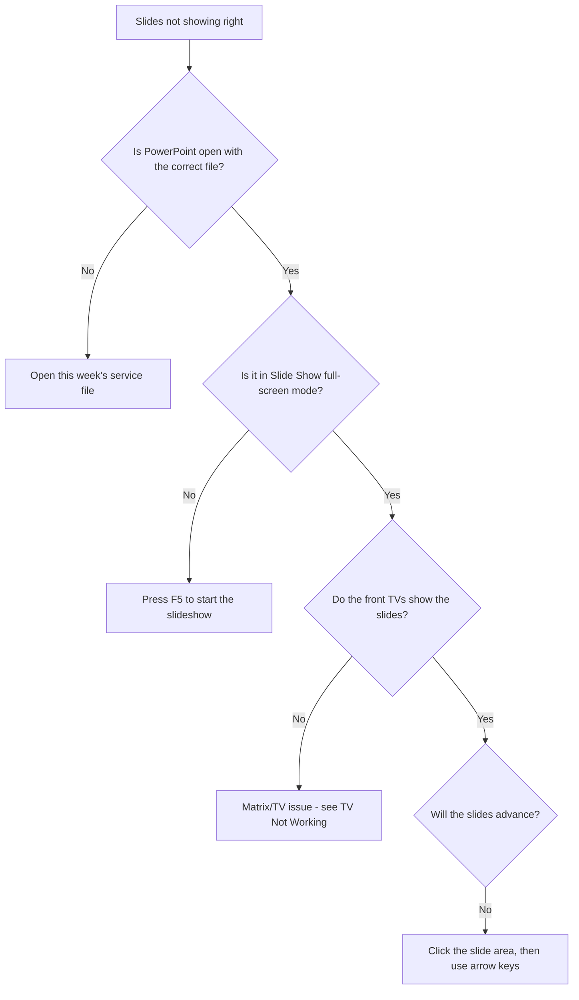

# Troubleshooting: PowerPoint Not Displaying

Use this page when the **slides aren't showing correctly** — the TVs show the
PowerPoint editing view or the desktop instead of full-screen slides, or the
slides won't advance.

!!! tip "Most common cause"
    PowerPoint is **not in Slide Show mode**. Press **F5** on the presentation
    PC to start the full-screen slideshow.

---

## Step-by-step checks

1. **Right file open?** Make sure **PowerPoint** is open with **this week's**
   service file.
2. **Slide Show mode?** Press **F5** (start from beginning) or **Shift + F5**
   (start from current slide) to go full screen.
3. **TVs not showing it?** If the PC is in Slide Show mode but the TVs don't
   show slides, it's a screen/routing issue → [TV Not Working](tv-not-working.md)
   and [Bluestream Matrix](../displays/bluestream-matrix.md).
4. **Slides won't advance?** Click once on the slide area to make sure
   PowerPoint has "focus", then use the **right arrow** / **spacebar**.

---

## The TVs show the desktop or PowerPoint menus

This means PowerPoint is **not presenting full screen**. Press **F5**.

!!! note "Presenter View vs Slide Show"
    If the PC shows notes/thumbnails while the TVs show the slide, that is
    **Presenter View** working correctly. If the **TVs** show the notes view,
    PowerPoint is showing on the wrong display — see the next section.

---

## Slides appear on the wrong screen

If the slideshow opens on the PC's own screen instead of the TVs:

1. In PowerPoint, go to the **Slide Show** tab.
2. Find **Monitor** and set it to the correct display (the one feeding the
   matrix / TVs).
3. Restart the slideshow (**F5**).

You can also use the Windows shortcut **{++Windows++ + ++P++}** to choose how
the displays are arranged (e.g. **Duplicate** or **Extend**).

!!! warning "Don't experiment during the service"
    If display settings get tangled mid-service, the quickest reliable fix is
    often to **set PowerPoint to Duplicate** so the TVs mirror the PC, get the
    slides showing, and sort out the proper Extend setup afterwards.

---

## Slides frozen or PowerPoint stuck

1. Press **Esc** to leave the slideshow.
2. Restart the slideshow with **F5** (or **Shift + F5** from the current
   slide).
3. If PowerPoint is fully frozen, close and reopen it; as a last resort
   restart the **NUC** (this also restarts Companion / the StreamDeck).

---

## Quick reference

| Symptom | Likely cause | Fix |
|---------|--------------|-----|
| TVs show desktop/menus | Not in Slide Show mode | Press **F5** |
| Slides on PC not TVs | Wrong monitor selected | Slide Show → Monitor; or {++Windows++ + ++P++} |
| Slides won't advance | PowerPoint lost focus | Click slide, use arrow keys |
| Everything frozen | PowerPoint/PC stuck | Esc, reopen, or restart NUC |

---

## Related pages

- [PowerPoint Operation](../presentation/powerpoint-operation.md)
- [TV Distribution](../displays/tv-distribution.md)
- [Bluestream Matrix](../displays/bluestream-matrix.md)
- [StreamDeck Buttons](../presentation/streamdeck-buttons.md)
