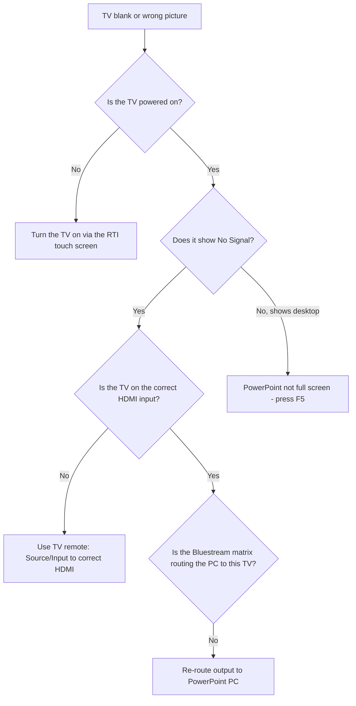

# Troubleshooting: TV Not Working

Use this page when a **TV or screen is blank**, shows "No Signal", or shows the
wrong picture.

!!! tip "Most common causes"
    The TV is **on the wrong HDMI input**, the **matrix is routed wrong**, or
    PowerPoint is **not in full-screen Slide Show mode**.

---

## Which screen?

| Screen | Where | Normally shows |
|--------|-------|----------------|
| Front TV Left | Front, left | Slides |
| Front TV Right | Front, right | Slides |
| Rear Confidence Monitor | Faces speaker | Slides |
| Fireplace TV | Fireplace | Slides (if used) |
| Meeting Room TV | Meeting room | Slides (if used) |

---

## Step-by-step checks

1. **TV on?** Turn it on from the **RTI 7" touch screen** (just below the PC) —
   the TVs are powered from the RTI, not the rack power strip.
2. **"No Signal"?** Then the TV isn't receiving a picture:
    - **Wrong HDMI input:** Use the TV remote's **Source / Input** button and
      select the correct **HDMI** input.
    - **Matrix routing:** Check the **Bluestream matrix** is sending the
      **PowerPoint PC** to this screen → [Bluestream Matrix](../displays/bluestream-matrix.md).
3. **Shows the desktop, not slides?** PowerPoint isn't full-screen — press
   **F5** on the PC → [PowerPoint Not Displaying](powerpoint-not-displaying.md).
4. **Only one front TV out?** That TV's power, its HDMI cable, or its input —
   the other TV working tells you the PC and matrix are fine.

---

## All TVs blank

If **every** screen is blank:

- Check the TVs were **turned on from the RTI touch screen** (try "all on"
  again).
- Check the **Bluestream matrix** has power.
- Check the **PowerPoint PC (NUC)** is on and outputting a picture.
- See [TV Distribution](../displays/tv-distribution.md) and
  [Bluestream Matrix](../displays/bluestream-matrix.md).

---

## Keep the service going

!!! note "The room can run without the TVs"
    If the TVs fail, the spoken service and singing continue. If song words
    are essential, a printed sheet or the band's own copies can cover the gap
    while you fix the screens or note them for Mills IT.

---

## Quick reference

| Symptom | Likely cause | Fix |
|---------|--------------|-----|
| One TV "No Signal" | Wrong input or cable | Set correct HDMI input; check cable |
| TV shows desktop | PowerPoint not full-screen | Press **F5** |
| TV shows wrong source | Matrix routed wrong | Re-route to PowerPoint PC |
| All TVs blank | Matrix or PC issue | Check matrix power and PC |

---

## Related pages

- [TV Distribution](../displays/tv-distribution.md)
- [Bluestream Matrix](../displays/bluestream-matrix.md)
- [PowerPoint Not Displaying](powerpoint-not-displaying.md)
