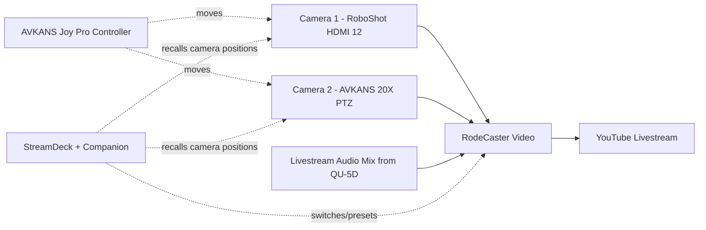

# Video Overview

This section explains the cameras and the livestream — how we film the service
and send it to YouTube. Like the audio section, it starts with the big picture
and then gives step-by-step detail on each part.

!!! tip "If you only read one thing"
    The **RodeCaster Video** is the centre of the video system. The two
    **cameras** feed into it, the **audio** feeds into it, and it streams the
    finished picture to **YouTube**. You mostly control it through the
    **StreamDeck** buttons.

---

## The big picture

---

## The parts and what they do

| Item | What it is | What you do with it |
|------|-----------|---------------------|
| **Camera 1 — RoboShot HDMI 12** | A motorised PTZ camera at the front | Usually the **wide** shot |
| **Camera 2 — AVKANS 20X PTZ Camera Pro** | A motorised PTZ camera | Usually **close-ups** (20× zoom) |
| **RodeCaster Video** | Video switcher + livestream encoder | Choose which camera is shown; start/stop the stream |
| **AVKANS Joy Pro Controller** | A joystick box for the cameras | Move and zoom the cameras by hand |
| **StreamDeck XL + Companion** | Labelled buttons that automate jobs | Switch cameras, recall camera positions, start/stop stream |

!!! note "What 'PTZ' means"
    **PTZ** stands for **Pan, Tilt, Zoom**. These cameras have motors so they
    can turn left/right (pan), up/down (tilt) and zoom in/out — without anyone
    standing behind them.

---

## How you normally control the video

You have **two ways** to control the cameras:

1. **The StreamDeck (easiest)** — press a button to switch to a camera or to
   send a camera to a saved position (a "preset"). This is what you will use
   most. See [StreamDeck Buttons](../presentation/streamdeck-buttons.md).
2. **The AVKANS Joy Pro Controller (manual)** — a joystick to move a camera
   live by hand when you need a shot that isn't saved. See
   [PTZ Controller](ptz-controller.md).

To choose which camera the livestream **shows**, use the **RodeCaster Video**
(usually via a StreamDeck button). See [Camera Operation](camera-operation.md).

---

## Which camera is which

| | Camera 1 | Camera 2 |
|--|----------|----------|
| **Model** | RoboShot HDMI 12 | AVKANS 20X PTZ Camera Pro |
| **Typical use** | Wide shot of the front | Close-ups (speaker, lectern) |
| **Zoom** | Standard | 20× (strong zoom) |

!!! tip "Remember it this way"
    **Camera 1 = wide, Camera 2 = close.** When unsure, stay on **Camera 1**
    (the wide shot) — it always looks acceptable.

---

## Related pages

- [RodeCaster Video](rodecaster-video.md) — start/stop the stream, switch cameras
- [Camera Operation](camera-operation.md) — choosing and switching shots
- [PTZ Controller](ptz-controller.md) — moving cameras by hand
- [StreamDeck Buttons](../presentation/streamdeck-buttons.md) — the button panel
